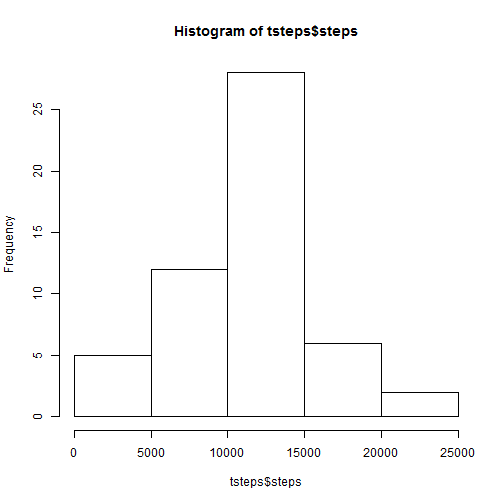
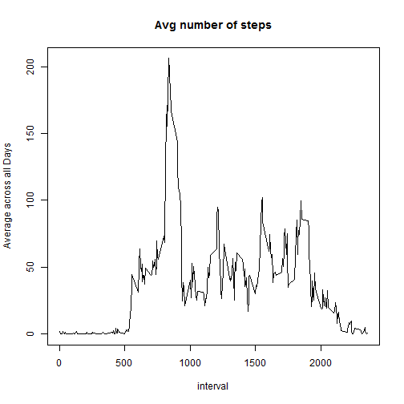
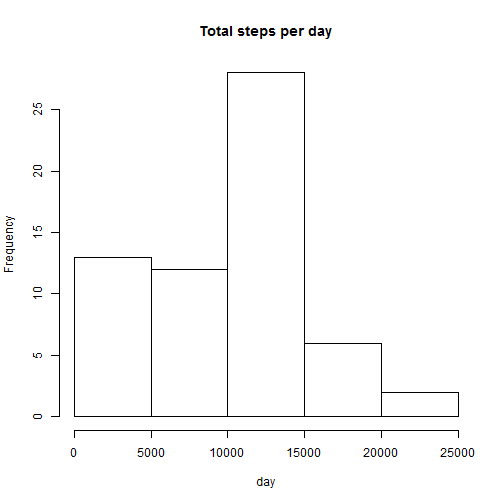
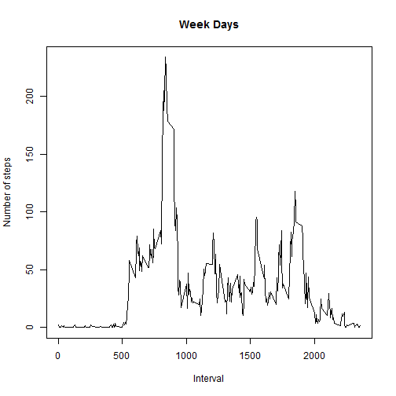
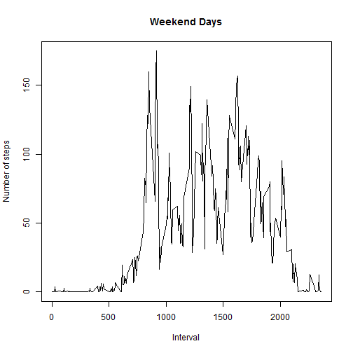

Course project 1 from Luis Hueso

#Loading and preprocessing the data

Load the data in current directory and convert the field 'Date' to Date type for further processing


```r
act<-read.csv("activity.csv")

act$date<-as.Date(act$date, format = "%Y-%m-%d") 
```

#Total steps per day

##Calculate the total number of steps taken per day


```r
tsteps <- aggregate(steps ~ date, data = act, sum, na.rm = TRUE)
```

##Histogram with the steps per day



##Median and Mean

Compute median and mean


```r
median(tsteps$steps,na.rm = TRUE)
```

```
## [1] 10765
```

```r
mean(tsteps$steps,na.rm = TRUE)
```

```
## [1] 10766.19
```


#Average daily activity pattern
##Time Series


```r
tseries <- tapply(act$steps, act$interval, mean, na.rm = TRUE)
```


##Time series plotted:


```r
plot(row.names(tseries), tseries, type = "l", xlab = "interval", ylab = "Average across all Days", main = "Avg number of steps")
```




##Max steps
Interval with  maximum number of steps


```r
minterval <- which.max(tseries)
names(minterval)
```

```
## [1] "835"
```

#Missing Values

total number of missing values in the dataset

```r
nna<-sum(is.na(act))
```


##Filling in all of the missing values in the dataset.


```r
stepavg <- aggregate(steps ~ interval, data = act, FUN = median)
fna<-c()
for (i in 1:nrow(act)) {
    obs <- act[i, ]
    if (is.na(obs$steps)) {
        steps <- subset(stepavg, interval == obs$interval)$steps
    } else {
        steps <- obs$steps
    }
    fna <- c(fna, steps)
}
```
##New dataset


```r
nact<-act
nact$steps<-fna
```

## histogram of the total number of steps taken each day

```r
tstep2 <- aggregate(steps ~ date, data = nact, sum, na.rm = TRUE)
hist(tstep2$steps, main = "Total steps per day", xlab = "day")
```



##mean and median total number of steps taken per day


```r
mean(tstep2$steps)
```

```
## [1] 9503.869
```

```r
median(tstep2$steps)
```

```
## [1] 10395
```


#Differences in activity patterns between weekdays and weekends


```r
day <- weekdays(act$date)
daytype <- c()
for (i in 1:nrow(act)) {
    if (day[i] == "Saturday" | day[i] == "Sunday" | day[i] == "sábado" | day[i] == "domingo") {
      
        daytype[i] <- "Weekend"
        
    } else {
        daytype[i] <- "Weekday"
    
        }
}
act$daytype <- daytype

dsteps <- aggregate(steps ~ interval + daytype, data = act, mean)
names(dsteps) <- c("interval", "daytype", "steps")

dstepswd<-subset(dsteps,daytype=="Weekday")
dstepswnd<-subset(dsteps,daytype=="Weekend")

plot(steps ~ interval , dstepswd, type = "l",   xlab = "Interval", ylab = "Number of steps",main="Week Days")
```



```r
plot(steps ~ interval , dstepswnd, type = "l",   xlab = "Interval", ylab = "Number of steps",main="Weekend Days")
```



